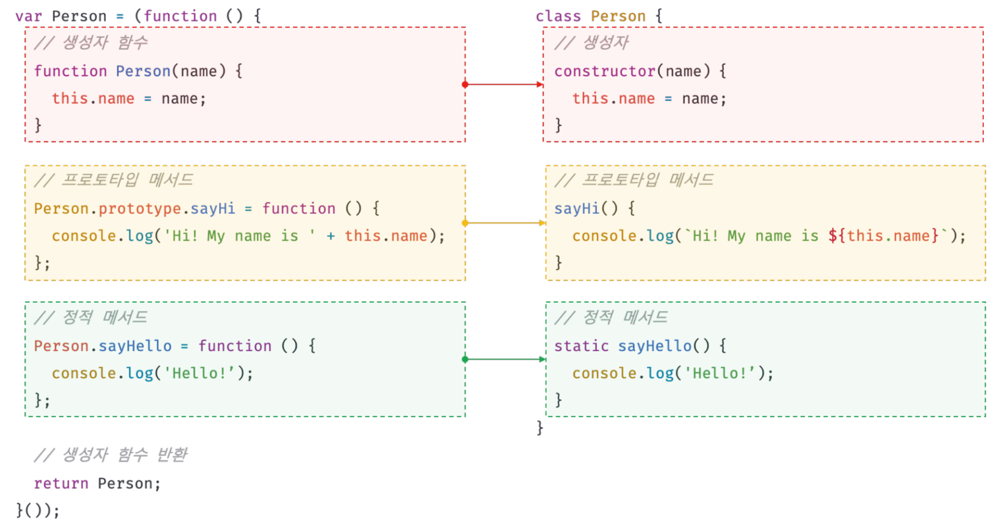

[Notion으로 보기](https://slime-fall-1f7.notion.site/25-1-223566396b51805199b8eada6f29b41a?source=copy_link)

[25장. 클래스(1)](#25장-클래스1)  
&nbsp;&nbsp;[25.1 클래스는 프로토타입의 문법적 설탕인가?](#251-클래스는-프로토타입의-문법적-설탕인가)  
&nbsp;&nbsp;[25.2 클래스 정의](#252-클래스-정의)  
&nbsp;&nbsp;[25.3 클래스 호이스팅](#253-클래스-호이스팅)  
&nbsp;&nbsp;[25.4 인스턴스 생성](#254-인스턴스-생성)  
&nbsp;&nbsp;[25.5 메서드](#255-메서드)  
&nbsp;&nbsp;[25.6 클래스의 인스턴스 생성 과정](#256-클래스의-인스턴스-생성-과정)  
&nbsp;&nbsp;[25.7 프로퍼티](#257-프로퍼티)

# 25장. 클래스(1)

## 25.1 클래스는 프로토타입의 문법적 설탕인가?

자바스크립트는 프로토타입 기반(prototype based) 객체지향 언어다.

프로토타입 기반 객체지향 언어는 클래스가 필요 없는(class free) 객체지향 프로그래밍 언어다. ES5에서는 클래스 없이도 다음과 같이 생성자 함수와 프로토타입을 통해 객체지향 언어의 상속을 구현할 수 있다.

```jsx
var Person = (function () {
  function Person(name) {
    this.name = name;
  }

  Person.prototype.sayHi = function () {
    console.log(`Hi! My name is ${this.name}`);
  };

  return Person;
})();

var me = new Person("Lee");
me.sayHi(); // Hi! My name is Lee
```

ES6의 클래스는 자바나 C# 같은 클래스 기반 객체지향 프로그래밍에 익숙한 프로그래머가 더욱 빠르게 학습할 수 있도록 클래스 기반 객체지향 프로그래밍 언어와 매우 흡사한 새로운 객체 생성 메커니즘을 제시한다. 기존의 프로토타입 기반 객체지향 모델을 폐지한 것은 아니다.

**클래스 vs. 생성자 함수**

클래스와 생성자 함수는 모두 프로토타입 기반의 인스턴스를 생성한다.

클래스는 생성자 함수보다 엄격하며 생성자 함수에서는 제공하지 않는 기능도 제공한다.

**클래스의 특징** (생성자 함수와 다른 점)

1. `new` 연산자 없이 호출하면 에러가 발생한다.
2. 상속을 지원하는 `extends`와 `super` 키워드를 제공한다.
3. 호이스팅이 발생하지 않는 것처럼 동작한다. (TDZ)
4. 모든 코드에는 암묵적으로 strict mode가 지정되어 실행되며, 해제할 수 없다.
5. constructor, 프로토타입 메서드, 정적 메서드는 모두 프로퍼티 어트리뷰트 `[[Enumerable]]` 값이 `false`다. 즉, 열거되지 않는다.

생성자 함수와 클래스는 모두 프로토타입 기반의 객체지향을 구현했다. 하지만 클래스의 객체 생성 방식은 더욱 견고하고 명료하다. 특히 `extends`와 `super` 키워드는 상속 관계 구현을 더욱 간결하고 명료하게 한다. 따라서 클래스를 프로토타입 기반 객체 생성 패턴의 단순한 문법적 설탕이라고 보기보다는 새로운 객체 생성 메커니즘으로 보는 것이 좀 더 합당하다.

## 25.2 클래스 정의

클래스는 `class` 키워드를 사용하여 정의한다. 클래스 이름은 파스칼 케이스를 사용하는 것이 일반적이다.

```jsx
// 클래스 선언문
class Person {}
```

클래스를 표현식으로 정의할 수 있다. 즉, 클래스는 값으로 사용할 수 있는 일급 객체다.

- 무명의 리터럴로 생성할 수 있다. 즉, 런타임에 생성이 가능하다.
- 변수나 자료구조에 저장할 수 있다.
- 함수의 매개변수에게 전달할 수 있다.
- 함수의 반환값으로 사용할 수 있다.

```jsx
// 익명 클래스 표현식
const Person = class {};

// 기명 클래스 표현식
const Person = class MyClass {};
```

클래스 몸체에는 0개 이상의 메서드만 정의할 수 있다. 정의할 수 있는 메서드는 ①constructor(생성자), ②프로토타입 메서드, ③정적 메서드다.

```jsx
class Person {
  // ① constructor (생성자)
  constructor(name) {
    this.name = name;
  }

  // ② 프로토타입 메서드
  sayHi() {
    console.log(`Hi! My name is ${this.name}`);
  }

  // ③ 정적 메서드
  static sayHello() {
    console.log("Hello!");
  }
}

// 인스턴스 생성
const me = new Person("Lee");

console.log(me); // Person { name: 'Lee' }

console.log(me.name); // Lee
me.sayHi(); // Hi! My name is Lee
Person.sayHello(); // Hello!
```

클래스와 생성자 함수의 정의 방식은 형태적인 면에서 매우 유사하다.



## 25.3 클래스 호이스팅

클래스는 함수로 평가된다.

```jsx
class Person {}
console.log(typeof Person); // function
```

클래스 선언문으로 정의한 클래스는 런타임 이전에 먼저 평가되어 함수 객체를 생성한다. 이때 생성된 함수 객체는 생성자 함수로서 호출할 수 있는 함수(constructor)다. 생성자 함수로서 호출할 수 있는 함수는 함수 객체가 생성되는 시점에 프로토타입도 더불어 생성된다.

클래스 선언문도 호이스팅이 발생한다. 그러나 클래스 선언문 이전에 일시적 사각지대(Temporal Dead Zone: TDZ)에 빠지기 때문에 호이스팅이 발생하지 않는 것처럼 동작한다.

```jsx
console.log(Person); // ReferenceError: Cannot access 'Person' before initialization

class Person {}
```

```jsx
const Person = "";
{
  // Person은 호이스팅되었지만 TDZ에 빠져있다.
  console.log(Person); // ReferenceError: Cannot access 'Person' before initialization

  class Person {}
}
```

<aside>

**(참고) 모든 선언문은 런타임 이전에 먼저 실행된다.**

var, let, const, function, function\*, class 키워드를 사용하여 선언된 모든 식별자는 호이스팅된다.

</aside>

## 25.4 인스턴스 생성

클래스는 생성자 함수이며 `new` 연산자와 함께 호출되어 인스턴스를 생성한다.

```jsx
class Person {}

// 인스턴스 생성
const me = new Person();
console.log(me); // Person {}
```

⚠️ 클래스는 인스턴스를 생성하는 것이 유일한 존재 이유이므로 반드시 new 연산자와 함께 호출해야 한다.

```jsx
class Person {}

const me = Person(); // TypeError: Class constructor Person cannot be invoked without 'new'
```

⚠️ 클래스 표현식으로 정의된 클래스의 경우 기명 클래스 표현식의 클래스 이름을 사용해 인스턴스를 생성하면 에러가 발생한다. 표현식의 클래스 이름은 클래스 몸체 내부에서만 유효한 식별자다.

```jsx
const Person = class MyClass {};

console.log(MyClass); // ReferenceError: MyClass is not defined
const you = new MyClass(); // ReferenceError: MyClass is not defined
```

## 25.5 메서드

클래스 몸체에는 0개 이상의 메서드만 선언할 수 있다. 정의할 수 있는 메서드는 다음과 같다.

① constructor(생성자) - 25.5.1

② 프로토타입 메서드 - 25.5.2

③ 정적 메서드 - 25.5.3

### 25.5.1 constructor

constructor는 인스턴스를 생성하고 초기화하기 위한 특수한 메서드다.

```jsx
class Person {
  constructor(name) {
    this.name = name;
  }
}
```

클래스는 인스턴스를 생성하기 위한 생성자 함수다.

클래스는 평가되어 함수 객체가 된다. 즉, 클래스도 함수 객체 고유의 프로퍼티를 모두 갖고 있으며, 프로토타입과 연결되어 자신의 스코프 체인을 구성한다.

prototype 프로퍼티가 가리키는 프로터타입 객체의 constructor 프로퍼티는 클래스 자신을 가리키고 있다. 이는 클래스가 인스턴스를 생성하는 생성자 함수라는 것을 의미한다. 즉 `new` 연산자와 함께 클래스를 호출하면 클래스는 인스턴스를 생성한다.

constructor 내부에서 this로 추가한 프로퍼티는 인스턴스 프로퍼티가 된다. constructor 내부의 this는 클래스가 생성한 인스턴스를 가리킨다.

```jsx
class Person {
  constructor(name) {
    this.name = name;
  }
}

const me = new Person("Kim");
console.log(me); // Person { name: 'Kim' }
```

클래스가 평가되어 생성된 함수 객체나 클래스가 생성한 인스턴스 어디에도 constructor 메서드는 보이지 않는다. 이는 클래스 몸체에 정의한 constructor가 단순한 메서드가 아니라는 것을 의미한다.

constructor는 메서드로 해석되는 것이 아니라 클래스가 평가되어 생성한 함수 객체 코드의 일부가 된다. 즉, 클래스 정의가 평가되면 constructor의 기술된 동작을 하는 함수 객체가 생성된다.

<aside>

**(참고) 클래스의 constructor 메서드와 프로토타입의 constructor 프로퍼티**

이름이 같아 혼동하기 쉽지만 직접적인 관련이 없다. 프로토타입의 constructor 프로퍼티는 모든 프로토타입이 가지고 있는 프로퍼티이며, 생성자 함수를 가리킨다.

</aside>

**constructor의 특징**

1. constructor는 클래스 내에 최대 한 개만 존재할 수 있다.

   - 만약 2개 이상의 constructor를 포함하면 문법 에러(SyntaxError)가 발생한다.
     ```
     class Person {
       constructor(){}
       constructor(){}
     } // SyntaxError: A class may only have one constructor
     ```
   - constructor를 생략하면 빈 constructor가 암묵적으로 정의된다. 이 클래스는 빈 constructor에 의해 빈 객체를 생성한다.

     ```jsx
     class Person {
       constructor() {}
     }

     const me = new Person();
     console.log(me); // Person {}
     ```

2. constructor 내에서는 인스턴스 생성과 동시에 인스턴스 프로퍼티 추가를 통해 인스턴스의 초기화를 실행한다. 인스턴스를 초기화하려면 constructor를 생략해서는 안된다.

   - 고정값으로 인스턴스 초기화

     ```jsx
     class Person {
       constructor() {
         this.name = "Lee";
         this.address = "Seoul";
       }
     }

     const me = new Person();
     console.log(me); // Person { name: 'Lee', address: 'Seoul' }
     ```

   - 인수로 인스턴스 초기화

     ```jsx
     class Person {
       constructor(name, address) {
         this.name = name;
         this.address = address;
       }
     }

     const me = new Person("Kim", "Busan");
     console.log(me); // Person { name: 'Kim', address: 'Busan' }
     ```

3. constructor는 별도의 반환문을 갖지 않아야 한다. `new` 연산자와 함께 클래스가 호출되면 암묵적으로 인스턴스(this)를 반환하기 때문이다. constructor 내부에서 명시적으로 this가 아닌 다른 값을 반환하는 것은 클래스의 기본 동작을 훼손하므로 return 문은 반드시 생략해야 한다.

   - 명시적으로 다른 객체를 반환하면 인스턴스(this)가 반환되지 못하고, return 문에 명시한 객체가 반환된다.

     ```jsx
     class Person {
       constructor(name) {
         this.name = name;

         return {};
       }
     }

     const me = new Person("Lee");
     console.log(me); // {}
     ```

   - 명시적으로 원시값을 반환하면 원시값 반환은 무시되고 암묵적으로 this가 반환된다.

     ```jsx
     class Person {
       constructor(name) {
         this.name = name;

         return 100;
       }
     }

     const me = new Person("Lee");
     console.log(me); // Person { name: 'Lee' }
     ```

### 25.5.2 프로토타입 메서드

클래스 몸체에서 정의한 메서드는 클래스의 prototype 프로퍼티에 메서드를 추가하지 않아도 기본적으로 프로토타입 메서드가 된다.

```jsx
class Person {
  // ① constructor (생성자)
  constructor(name) {
    this.name = name;
  }

  // ② 프로토타입 메서드
  sayHi() {
    console.log(`Hi! My name is ${this.name}`);
  }
}

const me = new Person("Lee");
me.sayHi(); // Hi! My name is Lee
```

클래스가 생성한 인스턴스는 프로토타입 체인의 일원이 된다. 클래스 몸체에서 정의한 메서드는 인스턴스의 프로토타입에 존재하는 프로토타입 메서드가 된다. 인스턴스는 프로토타입 메서드를 상속받아 사용할 수 있다.

프로토타입 체인은 클래스에 의해 생성된 인스턴스에도 동일하게 적용된다. 생성자 함수 역할을 클래스가 할 뿐이다. 결국 클래스는 인스턴스를 생성하는 생성자 함수라고 볼 수 있다. 클래스는 생성자 함수와 마찬가지로 프로토타입 기반의 객체 생성 메커니즘이다.

### 25.5.3 정적 메서드

정적(static) 메서드는 인스턴스를 호출하지 않아도 호출할 수 있는 메서드다.

클래스에서는 메서드에 `static` 키워드를 붙이면 정적 메서드(클래스 메서드)가 된다.

```jsx
class Person {
  // ① constructor (생성자)
  constructor(name) {
    this.name = name;
  }

  // ③ 정적 메서드
  static sayHi() {
    console.log("Hi!");
  }
}
```

정적 메서드는 클래스에 바인딩된 메서드가 된다.

정적 메서드는 클래스로 호출한다. 정적 메서드는 인스턴스로 호출할 수 없다. 인스턴스의 프로토타입 체인 상에는 클래스가 존재하지 않기 때문에 인스턴스로 클래스의 메서드를 상속받을 수 없다.

```jsx
// 정적 메서드는 클래스로 호출한다.
Person.sayHi(); // Hi!

// 정적 메서드는 인스턴스로 호출할 수 없다.
const me = new Person("Lee");
me.sayHi(); // TypeError: me.sayHi is not a function
```

### 25.5.4 정적 메서드와 프로토타입 메서드의 차이

정적 메서드와 프로토타입 메서드의 차이는 다음과 같다.

1. 정적 메서드와 프로토타입 메서드는 자신이 속해있는 프로토타입 체인이 다르다.
2. 정적 메서드는 클래스로 호출하고, 프로토타입 메서드는 인스턴스로 호출한다.
3. 정적 메서드는 인스턴스 프로퍼티를 참조할 수 없지만, 프로토타입 메서드는 인스턴스 프로퍼티를 참조할 수 있다.

```jsx
class Square {
  // ① constructor (생성자)
  constructor(width, height) {
    this.width = width;
    this.height = height;
  }

  // ② 프로토타입 메서드
  area1() {
    return this.width * this.height;
  }

  // ③ 정적 메서드
  static area2(width, height) {
    return width * height;
  }
}

// 인스턴스 생성
const square = new Square(10, 10);

// area1: 프로토타입 메서드
console.log(square.area1()); // 100
console.log(Square.area1()); // TypeError: Square.area1 is not a function

// area2: 정적 메서드
console.log(square.area2(10, 10)); // TypeError: square.area2 is not a function
console.log(Square.area2(10, 10)); // 100
```

프로토타입 메서드와 정적 메서드 내부의 this 바인딩이 다르다.

- **프로토타입 메서드**: 인스턴스로 호출해야 하므로 프로토타입 메서드 내부의 this는 프로토타입 메서드를 호출한 인스턴스를 가리킨다.
- **정적 메서드**: 클래스로 호출해야 하므로 정적 메서드 내부의 this는 인스턴스가 아닌 클래스를 가리킨다.

따라서 메서드 내부에서 인스턴스 프로퍼티를 참조할 필요가 있다면 this를 사용해야 하며, 프로토타입 메서드로 정의해야 한다. 물론 메서드 내부에서 this를 사용하지 않더라도 프로토타입 메서드로 정의할 수 있다. 하지만 반드시 인스턴스를 생성한 후 인스턴스를 통해 호출해야 하므로 this를 사용하지 않는 메서드는 정적 메서드로 정의하는 것이 좋다.

**정적 메서드의 활용**

정적 메서드는 애플리케이션 전역에서 사용할 유틸리티 함수를 전역 함수로 정의하지 않고 메서드로 구조화할 때 유용하다. 클래스 또는 생성자 함수를 하나의 네임스페이스로 사용하여 정적 메서드를 모아놓으면 이름 충돌 가능성을 줄여 주고 관련 함수들을 구조화할 수 있는 효과가 있다.

표준 빌드인 객체인 Math, Number, JSON, Object, Reflect 등도 다양한 정적 메서드를 가지고 있다. 표준 빌드인 객체의 정적 메서드는 인스턴스와 상관없이 애플리케이션 전역에서 사용할 유틸리티 함수다.

```jsx
// 표준 빌트인 객체의 정적 메서드
Math.max(1, 2, 3); // 3
Number.isNaN(NaN); // true
JSON.stringify({ a: 1 }); // {"a":1}
Object.is({}, {}); // false
Reflect.has({ a: 1 }, "a"); // true
```

### 25.5.5 클래스에서 정의한 메서드의 특징

클래스에서 정의한 메서드는 다음과 같은 특징을 갖는다.

1. `function` 키워드를 생략한 메서드 축약 표현을 사용한다.
2. 클래스에서 메서드를 정의할 때는 콤마가 필요 없다.
3. 암묵적으로 strict mode로 실행된다.
4. `for…in` 문이나 `Object.keys` 메서드 등으로 열거할 수 없다. 프로퍼티 어트리뷰트 `[[Enumerable]]` 값이 `false`다.
5. 내부 메서드 `[[Construct]]`를 갖지 않는 non-constructor다. `new` 연산자와 함께 호출할 수 없다.

## 25.6 클래스의 인스턴스 생성 과정

`new` 연산자와 함께 클래스를 호출하면 클래스의 내부 메서드 `[[Construct]]`가 호출되고, 다음과 같은 과정을 거쳐 인스턴스가 생성된다.

1. **인스턴스 생성과 this 바인딩**

   `new` 연산자와 함께 클래스를 호출하면 암묵적으로 빈 객체가 생성된다. 이 빈 객체가 클래스가 생성한 인스턴스다. 이때 클래스가 생성한 인스턴스의 프로토타입으로 클래스의 `prototype` 프로퍼티가 가리키는 객체가 설정된다. 인스턴스는 this에 바인딩된다. 즉, constructor 내부의 this는 클래스가 생성한 인스턴스를 가리킨다.

2. **인스턴스 초기화**

   constructor의 내부 코드가 실행되어 this에 바인딩되어 있는 인스턴스를 초기화한다. this에 바인딩되어 있는 인스턴스에 프로퍼티를 추가하고 constructor가 인수로 전달받은 초기값으로 인스턴스의 프로퍼티 값을 초기화한다. (constructor가 생략되었다면 이 과정도 생략한다.)

3. **인스턴스 반환**

   클래스의 모든 처리가 끝나면 완성된 인스턴스가 바인딩된 this가 암묵적으로 반환된다.

```jsx
class Person {
  constructor(name) {
    // 1. 암묵적으로 인스턴스가 생성되고 this에 바인딩된다. this: Person {}

    // 2. this에 바인딩되어 있는 인스턴스를 초기화한다. this: Person { name: *name* }
    this.name = name;

    // 3. 완성된 인스턴스가 바인딩된 this가 암묵적으로 반환된다.
  }
}
```

## 25.7 프로퍼티

### 25.7.1 인스턴스 프로퍼티

인스턴스 프로퍼티는 constructor 내부에 정의해야 한다. constructor 내부에서 this에 추가한 프로퍼티는 언제나 클래스가 생성한 인스턴스의 프로퍼티가 된다.

```jsx
class Person {
  constructor(name) {
    // 인스턴스 프로퍼티
    this.name = name;
  }
}

const me = new Person("Kim");

console.log(me); // Person { name: 'Kim' }
console.log(me.name); // Kim
```

ES6의 클래스는 다른 객체지향 언어처럼 `private`, `public`, `protected` 키워드와 같은 접근 제한자(access modifier)를 지원하지 않는다. 따라서 인스턴스 프로퍼티는 언제나 public하다.

### 25.7.2 접근자 프로퍼티

**접근자 프로퍼티 accessor property**

자체적으로는 값(`[[Value]]`)을 갖지 않고 다른 데이터 프로퍼티의 값을 읽거나 저장할 때 사용하는 접근자 함수(getter 함수와 setter 함수)로 구성된 프로퍼티

- **getter**: 인스턴스 프로퍼티에 접근할 때마다 프로퍼티 값을 조작하거나 별도의 행위가 필요할 때 사용한다. 메서드 앞에 `get` 키워드를 사용해 정의한다.
- **setter**: 인스턴스 프로퍼티에 값을 할당할 때마다 프로퍼티 값을 조작하거나 별도의 행위가 필요할 때 사용한다. 메서드 이름 앞에 `set` 키워드를 사용해 정의한다.

```jsx
class Person {
  constructor(firstName, lastName) {
    this.firstName = firstName;
    this.lastName = lastName;
  }

  // fullName은 접근자 함수로 구성된 접근자 프로퍼티다.
  // getter 함수
  get fullName() {
    return `${this.firstName} ${this.lastName}`;
  }

  // setter 함수
  set fullName(name) {
    [this.firstName, this.lastName] = name.split(" ");
  }
}

const me = new Person("Ungmo", "Lee");
console.log(me); // Person { firstName: 'Ungmo', lastName: 'Lee' }

// 데이터 프로퍼티를 통한 프로퍼티 값 참조
console.log(`${me.firstName} ${me.lastName}`); // Ungmo Lee

// 접근자 프로퍼티를 통한 프로퍼티 값 저장
me.fullName = "Heegun Lee";
console.log(me); // Person { firstName: 'Heegun', lastName: 'Lee' }

// 접근자 프로퍼티를 통한 프로퍼티 값 참조
console.log(me.fullName); // Heegun Lee

console.log(Object.getOwnPropertyDescriptor(Person.prototype, "fullName"));
// { get: [Function: get fullName], set: [Function: set fullName], enumerable: false, configurable: true }
```

클래스의 메서드는 기본적으로 프로토타입 메서드가 된다. 따라서 클래스의 접근자 프로퍼티 또한 인스턴스 프로퍼티가 아닌 프로토타입의 프로퍼티가 된다.

```jsx
Object.getOwnPropertyNames(me); // [ 'firstName', 'lastName' ]
Object.getOwnPropertyNames(Object.getPrototypeOf(me)); // [ 'constructor', 'fullName' ]
```

### 25.7.3 클래스 필드 정의 제안

[MDN-Public class fields](https://developer.mozilla.org/en-US/docs/Web/JavaScript/Reference/Classes/Public_class_fields)

**클래스 필드 class field**

클래스 기반 객체지향 언어에서 클래스가 생성할 인스턴스의 프로퍼티를 가리키는 용어

**Java**

- 자바의 클래스에서는 클래스 필드를 마치 변수처럼 클래스 몸체에 this 없이 선언할 수 있다.
- 자바의 클래스에서는 this를 생략해도 클래스 필드를 참조할 수 있다.
- 자바에서 this는 주로 클래스 필드가 생성자 또는 메서드의 매개변수 이름과 동일할 때 클래스 필드임을 명확하게 하기 위해 사용한다.

**기존 JavaScript**

- 자바스크립트의 클래스에서 인스턴스 프로퍼티를 선언하고 초기화하려면 반드시 constructor 내부에서 this에 프로퍼티를 추가해야 한다.
- 자바스크립트의 클래스에서 인스턴스 프로퍼티를 참조하려면 반드시 this를 사용하여 참조해야 한다.
- 자바스크립트의 클래스 몸체(class body)에는 메서드만 선언할 수 있다.

**ECMA 2022**

**클래스 필드 정의 Class field definitions**

클래스 몸체에서 클래스 필드를 정의할 수 있다.

```jsx
class Person {
  // 클래스 필드 정의
  name = "Lee";
}

const me = new Person();
console.log(me); // Person { name: 'Lee' }
```

**클래스 필드 사용 시 주의 사항**

⚠️ 클래스 필드를 정의하는 경우 this에 클래스 필드를 바인딩하면 안 된다. this는 클래스의 constructor와 메서드 내에서만 유효하다.

```jsx
class Person {
  this.name='Kim'; // SyntaxError: Unexpected token '.'
}
```

⚠️ 클래스 필드를 참조하는 경우 this를 반드시 사용해야 한다.

```jsx
class Person {
  name = "Lee";

  constructor() {
    console.log(name); // ReferenceError: name is not defined
  }
}

new Person();
```

⚠️ 클래스 필드에 초기값을 할당하지 않으면 undefined를 갖는다.

```jsx
class Person {
  name;
}

const me = new Person();
console.log(me); // Person { name: undefined }
```

인스턴스를 생성할 때 외부의 초기값으로 클래스 필드를 초기화하고 싶다면 constructor에서 클래스 필드를 초기화해야 한다. 따라서 클래스 필스를 초기화해야 한다면 constructor 밖에서 클래스 필드를 정의할 필요가 없다. 클래스가 생성한 인스턴스(this)에 클래스 필드에 해당하는 프로퍼티가 없다면 자동 추가되기 때문이다.

```jsx
class Person {
  constructor(name) {
    this.name = name;
  }
}

const me = new Person("Lee");
console.log(me); // Person { name: 'Lee' }
```

함수는 일급 객체이므로 함수를 클래스 필드에 할당할 수 있다. 따라서 클래스 필드를 통해 메서드를 정의할 수도 있다. 모든 클래스 필드는 인스턴스 프로퍼티가 되기 때문에, 클래스 필드에 할당된 함수도 프로토타입 메서드가 아닌 인스턴스 메서드가 된다. 따라서 클래스 필드에 함수를 할당하는 것은 권장하지 않는다.

```jsx
class Person {
  name = "Lee";

  getName = function () {
    return this.name;
  };

  getName2 = () => this.name;
}
const me = new Person();
```

클래스 필드 정의 제안으로 인해 인스턴스 프로퍼티를 정의하는 방식은 두 가지가 되었다.

1. 외부 초기값으로 클래스 필드를 초기화할 필요가 있다면 constructor에서 인스턴스 프로퍼티를 정의하는 기존 방식을 사용한다.
2. 외부 초기값으로 클래스 필드를 초기화할 필요가 없다면 기존의 constructor 방식과 클래스 필드 정의 제안 모두 사용할 수 있다.

### 25.7.4 private 필드 정의 제안

[MDN-Private class fields](https://developer.mozilla.org/ko/docs/Web/JavaScript/Reference/Classes/Private_elements)

**기존 JavaScript**

자바스크립트는 캡슐화를 완전하게 지원하지 않는다. ES6의 클래스도 private, public, protected 키워드와 같은 접근 제한자를 지원하지 않는다. 따라서 인스턴스 프로퍼티는 언제나 public이다. 클래스 외부에서 인스턴스를 통해 언제나 참조할 수 있다.

**ECMA 2019**

**private 필드**

해쉬 `#`을 붙여 private 필드를 정의할 수 있다. 참조할 때도 `#`를 붙여주어야 한다.

```jsx
class Person {
  #name = "";

  constructor(name) {
    this.#name = name;
  }
}

const me = new Person("Lee");

console.log(me.#name); // SyntaxError: Private field '#name' must be declared in an enclosing class
```

public 필드는 어디서든 참조할 수 있지만 private 필드는 클래스 내부에서만 참조할 수 있다.

클래스 외부에서 private 필드에 직접 접근할 수 있는 방법은 없다. 다만 접근자 프로퍼티를 통해 간접적으로 접근하는 방법은 유효하다.

```jsx
class Person {
  // private 필드 정의
  #name = "";

  constructor(name) {
    this.#name = name;
  }

  // 접근자 프로퍼티
  get name() {
    return this.#name.trim();
  }
}

const me = new Person("  Lee  ");
console.log(me.name); // Lee
```

⚠️ private 필드는 반드시 클래스 몸체에 정의해야 한다. private 필드를 contructor에 정의하면 에러가 발생한다.

```jsx
class Person {
  constructor(name) {
    this.#name = name; // SyntaxError: Private field '#name' must be declared in an enclosing class
  }
}
```

<aside>

**(참고) 타입스크립트의 접근 제한자**

타입스크립트는 클래스 기반 객체지향 언어가 지원하는 접근 제한자인 `public`, `private`, `protected`를 모두 지원하며, 의미 또한 기본적으로 동일하다.

</aside>

### 25.7.5 static 필드 정의 제안

<aside>

**정적 메서드와 속성 (ECMAScript 2022)**

> static 키워드는 클래스를 위한 정적(static) 메서드를 정의합니다. 정적 메서드는 클래스의 인스턴스화(instantiating) 없이 호출되며, 클래스의 인스턴스에서는 호출할 수 없습니다. 정적 메서드는 어플리케이션(application)을 위한 유틸리티(utility) 함수를 생성하는 데 주로 사용됩니다. 반면, 정적 속성은 캐시, 고정 환경설정 또는 인스턴스 간에 복제할 필요가 없는 기타 데이터에 유용합니다.

</aside>

**기존 JavaScript**

클래스에는 `static` 키워드를 사용하여 정적 메서드를 정의할 수 있다. 하지만 `static` 키워드를 사용하여 정적 필드를 정의할 수는 없었다. 즉, static public 메서드만 존재했다.

**ECMA 2022**

static public 필드, static private 필드, static private 메서드를 정의할 수 있다.

```jsx
class MyMath {
  static PI = 22 / 7;

  static #num = 10;

  static #increment() {
    return ++MyMath.#num;
  }
}

console.log(MyMath.PI); // 3.142857142857143
console.log(MyMath.increment()); // 11
```

<aside>

**(참고) 클래스 필드 / 생성자 / 인스턴스 메서드 / 정적 메서드**

```bash
class
├── ① constructor(생성자)
├── ② 프로토타입 메서드
├── ③ 정적 메서드
└── ④ 클래스 필드 - NEW!
```

```jsx
class Person {
  // ④ 클래스 필드 (public + private)
  name; // public 인스턴스 필드 (명시 안 해도 기본적으로 public)
  #age; // private 인스턴스 필드 (해시 `#` 문법)
  static species = "human"; // public 정적 필드
  static #count = 0; // private 정적 필드

  // ① 생성자
  constructor(name, age) {
    this.name = name;
    this.#age = age;
    Person.#count++; // private 정적 필드 사용
  }

  // ② 프로토타입 메서드 (public)
  sayHi() {
    console.log(`Hi! My name is ${this.name}. I’m ${this.#age} years old.`);
  }

  // ② 프로토타입 메서드 (private)
  #whisper() {
    console.log("(whispers) Don't tell anyone my age.");
  }

  // ③ 정적 메서드 (public)
  static sayHello() {
    console.log("Hello! We are all " + this.species);
  }

  // ③ 정적 메서드 (private)
  static #logCount() {
    console.log(`Total created: ${Person.#count}`);
  }
}
```

</aside>

∎
