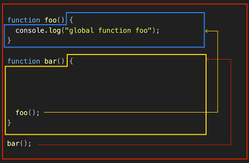
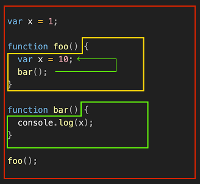
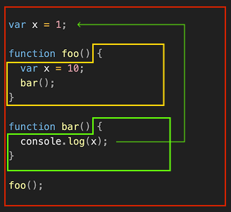
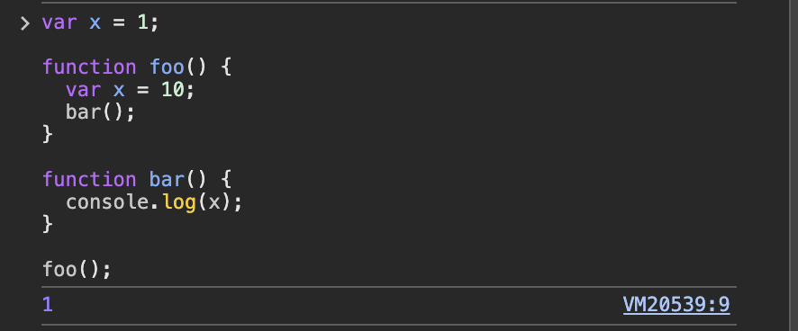

[Notion으로 보기](https://slime-fall-1f7.notion.site/13-1eb566396b5180e68a35eab02ed2cb5c?pvs=4)

[13장. 스코프](#13장-스코프)  
&nbsp;&nbsp;[13.1 스코프란?](#131-스코프란)  
&nbsp;&nbsp;[13.2 스코프의 종류](#132-스코프의-종류)  
&nbsp;&nbsp;[13.3 스코프 체인](#133-스코프-체인)  
&nbsp;&nbsp;[13.4 함수 레벨 스코프](#134-함수-레벨-스코프)  
&nbsp;&nbsp;[13.5 렉시컬 스코프](#135-렉시컬-스코프)

# 13장. 스코프

## 13.1 스코프란?

**스코프 scope**

모든 식별자(변수 이름, 함수 이름, 클래스 이름 등)가 유효한 범위

모든 식별자는 자신이 선언된 위치에 의해 다른 코드가 식별자 자신을 참조할 수 있는 유효 범위가 결정된다.

```jsx
var var1 = 1;

if (true) {
  var var2 = 2;

  if (true) {
    var var3 = 3;
  }
}

function foo() {
  var var4 = 4;

  function bar() {
    var var5 = 5;
  }
}

console.log(var1); // 1
console.log(var2); // 2
console.log(var3); // 3
console.log(var4); // ReferenceError: var4 is not defined
console.log(var5); // ReferenceError: var5 is not defined
```

**식별자 결정 identifier resolution**

자바스크립트 엔진이 이름이 같은 변수 중 어떤 변수를 참조해야 할 것인지 스코프를 통해 결정하는 것

스코프란 자바스크립트 엔진이 식별자를 검색할 때 사용하는 규칙이라고도 할 수 있다.

자바스크립트 엔진은 코드를 실행할 때 코드의 문맥(context)을 고려한다. 코드가 어디서 실행되며 주변에 어떤 코드가 있는지에 따라 동일한 코드도 다른 결과를 만들어낸다.

```jsx
var x = "global";

function foo() {
  var x = "local";
  console.log(x); // local
}

foo(x);
console.log(x); // global
```

**렉시컬 환경 lexical environment**

코드가 어디서 실행되며 주변에 어떤 코드가 있는지에 대한 정보를 담고 있다.

**코드의 문맥**(context)은 렉시컬 환경으로 이루어진다. 이를 구현한 것이 실행 컨텍스트(execution context)이며, 모든 코드는 실행 컨텍스트에서 평가되고 실행된다.

**스코프는 네임스페이스다.**

프로그래밍 언어에서는 스코프(유효 범위)를 통해 식별자인 변수 이름의 충돌을 방지하여 같은 이름의 변수를 사용할 수 있게 한다. 스코프 내에서 식별자는 유일해야 하지만 다른 스코프에서는 같은 이름의 식별자를 사용할 수 있다.

**주의: var 키워드로 선언한 변수의 중복 선언**

var 키워드로 선언된 변수는 같은 스코프 내에서 중복 선언이 허용된다. 이는 의도치 않게 변수값이 재할당되어 변경되는 부작용을 발생시킨다.

<table>
<tr>
<th>var</th>
<th>let</th>
</tr>
<tr>
<td>

```jsx
function foo() {
  var x = 1;
  var x = 2;
  console.log(x); // 2
}

foo();
```

</td>
<td>

```jsx
function bar() {
  let x = 1;
  let x = 2; // SyntaxError: Identifier 'x' has already been declared
}

bar();
```

</td>
</tr>
</table>

## 13.2 스코프의 종류

변수는 자신이 선언된 위치(전역 또는 지역)에 의해 자신이 유효한 범위인 스코프가 결정된다.

- 전역에서 선언된 변수 = 전역 스코프를 갖는 전역 변수
- 지역에서 선언된 변수 = 지역 스코프를 갖는 지역 변수

| **구분**    | **설명**              | **스코프**  | **변수**  |
| ----------- | --------------------- | ----------- | --------- |
| 전역 global | 코드의 가장 바깥 영역 | 전역 스코프 | 전역 변수 |
| 지역 local  | 함수 몸체 내부        | 지역 스코프 | 지역 변수 |

### 13.2.1 전역과 전역 스코프

전역 변수는 어디서든지 참조할 수 있다.

### 13.2.2 지역과 지역 스코프

지역 변수는 자신의 지역 스코프와 하위 지역 스코프에서 유효하다.

## 13.3 스코프 체인

**스코프 체인 scope chain**

스코프가 계층적으로 연결된 것

모든 스코프는 하나의 계층적 구조로 연결되며, 모든 지역 스코프의 최상위 스코프는 전역 스코프다.

변수를 참조할 때 자바스크립트 엔진은 스코프 체인을 통해 변수를 참조하는 코드의 스코프에서 시작하여 상위 스코프 방향으로 이동하며 선언된 변수를 검색(identifier resolution)한다.

**스코프 체인은 물리적인 실체로 존재한다.**

자바스크립트 엔진은 코드를 실행하기에 앞서 자료구조인 렉시컬 환경(Lexical Environment)을 실제로 생성한다. 변수 선언이 실행되면 변수 식별자가 이 자료구조(렉시컬 환경)에 키(key)로 등록되고, 변수 할당이 일어나면 이 자료구조의 변수 식별자에 해당하는 값을 변경한다. 변수의 검색도 이 자료구조 상에서 이루어진다.

### 13.3.1 스코프 체인에 의한 변수 검색

상위 스코프에서 유효한 변수는 하위 스코프에서 자유롭게 참조할 수 있지만 하위 스코프에서 유효한 변수를 상위 스코프에서 참조할 수 없다.

```jsx
var x = "global x";
var y = "global y";

function outer() {
  var z = "outer's local z";

  console.log(x); // global x
  console.log(y); // global y
  console.log(z); // outer's local z

  function inner() {
    var x = "inner's local x";

    console.log(x); // inner's local x
    console.log(y); // global y
    console.log(z); // outer's local z
  }

  inner();
}

outer();

console.log(x); // global x
console.log(y); // global y
console.log(z); // ReferenceError: z is not defined
```

### 13.3.2 스코프 체인에 의한 함수 검색

함수도 식별자에 할당되기 때문에 스코프를 갖는다.

```jsx
function foo() {
  console.log("global function foo");
}

function bar() {
  function foo() {
    console.log("local function foo");
  }

  foo();
}

bar();
```

> **(참고) 만약 bar 내부에 foo가 없다면**
>
> 자바스크립트는 스코프 체인을 따라 올라가며 `foo`를 찾고, 전역 스코프의 `foo()`를 발견해서 호출한다.
>
> 

## 13.4 함수 레벨 스코프

**블록 레벨 스코프 block level scope**  
모든 코드 블록(if, for, while, try/catch 등)이 지역 스코프를 만든다. (대부분의 프로그래밍 언어)

**함수 레벨 스코프 function level scope**  
오로지 함수의 코드 블록(함수 몸체)만을 지역 스코프로 인정한다. (javascript의 var)

- var 키워드로 선언된 변수: 오로지 함수의 코드 블록만을 지역 스코프로 인정한다.
- let, const 키워드로 선언된 변수: 블록 레벨 스코프를 지원한다. 모든 코드 블록을 지역 스코프로 인정한다. (ES6)

<table>
<tr>
<th>var</th>
<th>let</th>
</tr>
<tr>
<td>
예제 13-07

```js
var x = 1;

if (true) {
  var x = 10;
}

console.log(x); // 10
```

</td>
<td>

```jsx
let x = 1;

if (true) {
  let x = 10;
}

console.log(x); // 1
```

</td>
</tr>
<tr>
<td>
예제 13-08

```jsx
var i = 10;

for (var i = 0; i < 5; i++) {
  console.log(i); // 0 1 2 3 4
}

console.log(i); // 5
```

</td>
<td>

```jsx
let i = 10;

for (let i = 0; i < 5; i++) {
  console.log(i); // 0 1 2 3 4
}

console.log(i); // 10
```

</td>
</tr>
</table>

## 13.5 렉시컬 스코프

```jsx
var x = 1;

function foo() {
  var x = 10;
  bar();
}

function bar() {
  console.log(x);
}

foo();
```

위 예제(13-09)의 실행 결과는 bar 함수의 상위 스코프가 무엇인지에 따라 결정된다.

<table>
<tr>
<td>

**예측 1. 함수를 어디서 호출했는지에 따라 함수의 상위 스코프를 결정한다.**

bar 함수는 foo 함수 내부에서 호출되었다.  
→ bar 함수의 상위 스코프: foo 함수 블록  
⇒ 예상 결과: 10



이와 같은 방식을 **동적 스코프(dynamic scope)**라 한다. 함수를 정의하는 시점에는 함수가 어디서 호출될지 알 수 없으며, 함수가 호출되는 시점에 동적으로 상위 스코프를 결정한다.

</td>
<td>

**예측 2. 함수를 어디서 정의했는지에 따라 함수의 상위 스코프를 결정한다.**

bar 함수는 전역에 정의되었다.  
→ bar 함수의 상위 스코프: 전역  
⇒ 예상 결과: 1



이와 같은 방식을 **정적 스코프(static scope)** 또는 **렉시컬 스코프(lexical scope)**라 한다. 함수 정의가 평가되는 시점에 상위 스코프가 정적으로 결정된다.

</td>
</tr>
</table>

**자바스크립트는 렉시컬 스코프를 따른다.**

함수를 어디서 정의했는지에 따라 상위 스코프를 결정한다. 함수가 호출된 위치는 상위 스코프 결정에 어떠한 영향도 주지 않는다. 함수의 상위 스코프는 언제나 자신이 정의된 스코프다.  
함수의 상위 스코프는 함수 정의가 실행될 때 정적으로 결정된다. 함수 정의가 실행되어 생성된 함수 객체는 결정된 상위 스코프를 기억하고, 함수가 호출될 때마다 함수의 상위 스코프를 참조한다.

따라서, 예제 13-09의 결과는 다음과 같다:



∎
